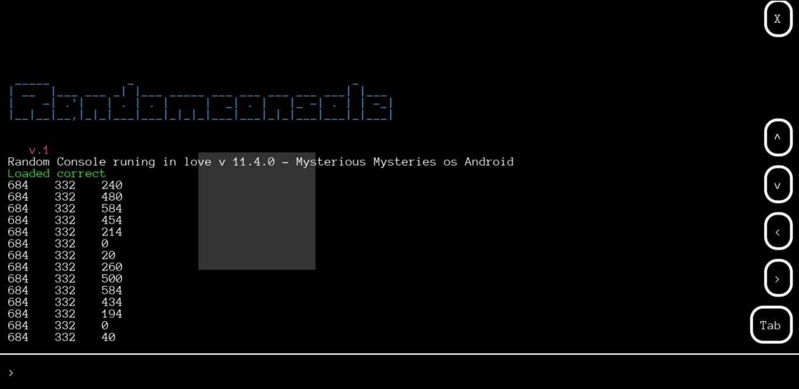
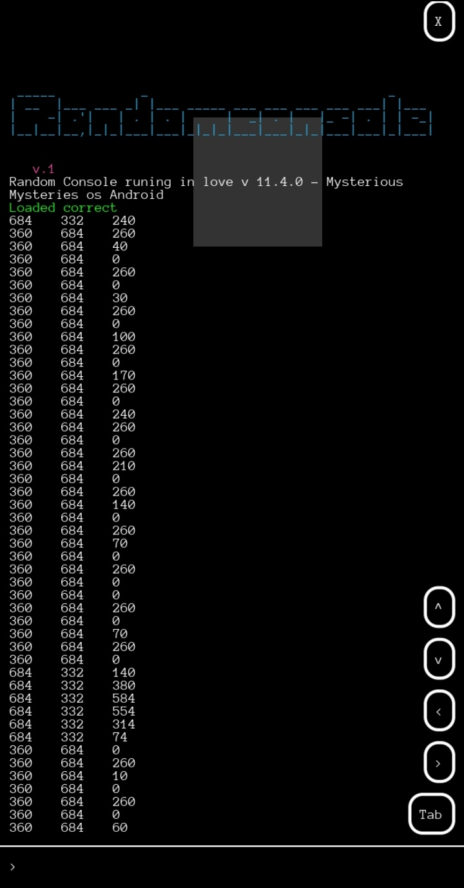

# love-console


## Features
- Activate and deactivate the console with the `F1` key. but can you change the key
- Activate and deactivate the console view with the `F2` key. but can you change the key

- Use the `left` and `right` arrows to navigate the cursor.
- `shift-left` and `shift-right` navigate by word.
- `ctrl-left` and `ctrl-right` navigate to the end of the line.
- 
- Evaluate both expressions and statements.
- 
- Use the `up` and `down` arrow keys to access history.
- Use `_` to access the last returned value, and `last` to access all of the last returned values as a table.
- Use `ctrl+` and `ctrl-` to change font size for mobile `ctrl=`
- Use `ctrlc` to copy text
- Use `ctrlv` to paste text
- Use `ctrlx` to cut text
- Use `ctrlw` to clear console
- Use `ctrle` to close lovegame

## functions

### console.init(defaultCommands, welcomeText, settings, style)
`console.init(arguments) or console(arguments)`

starts the console and prepares it for its that, it must be important to be called at startup

#### defaultCommands (bool)
- default or if is nil, is true

if is false, not load default commands like that help, exit, clear

#### welcomeText (bool)
- default or if is nil, is true

if is false, not print welcome text

#### settings (table)
- default or if is nil, is empty the table

set settings console

##### return self


### console.setStyle(style)
`console.setStyle(style)`

is for change style console


- default style
```
style = {
  background_color = {0, 0, 0, 0.8},
  text_color = {1, 1, 1, 1},
  completion_text_color = {1, 1, 1, 0.4},
  error_color = {1, 0, 0, 1},
  succeful_color = {25/255, 1, 25/255, 1},
  warning_color = {1,1,0,1},
  font_path = path .. "/AnonymicePowerline.ttf",
  font_size = 5,
  font = nil
 }
```


### console.setSettings(settings)
`console.setSettings(settings)`

is for change settings console


- default settings
```
settings = {
  switchEnabled = "f1",
  switchView = "f2",
  canOpenWithInput = true
 }
```

## Integrating the Console

```lua
--isn't necessary for the console is your
love.keyboard.setKeyRepeat(true)

function love.load()
 --require and  load console
 console = require "randomconsole"(settings)
 
 --add new commands
 console.addComand("name", 
 function ()
  --do something
 end, "help text, isn't necessary")
 
 --open the console
 --console can open with keyword or with function console.open()
 console.open()
end

function love.draw()
  --draw the console
  console.draw()
end

--is necessary for mobile for pc is not matter
function love.touchreleased(id, x, y) 
 console.press(x, y)
end

--is necessary
function love.keypressed(key, scancode, isrepeat)
 console.keypressed(key, scancode, isrepeat)
end

--is necessary
function love.textinput(text)
 console.textinput(text)
end
```

## Preview



[Love console](https://github.com/rameshvarun/love-console)
